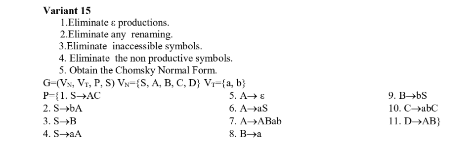
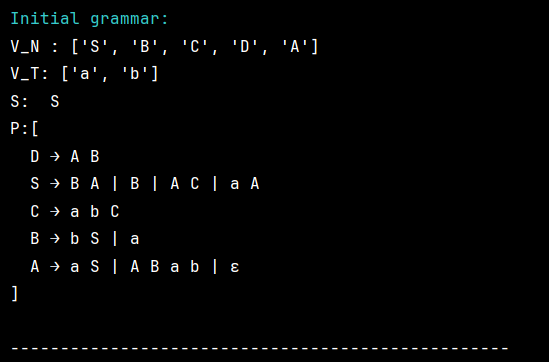
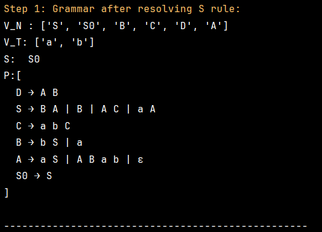
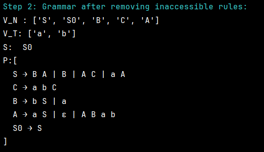
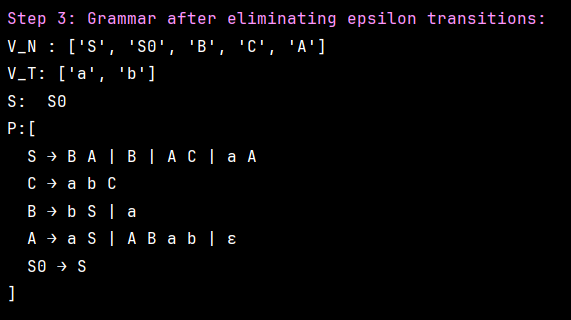
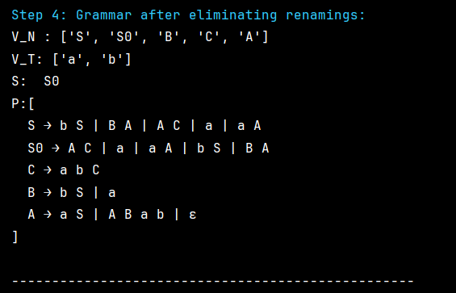
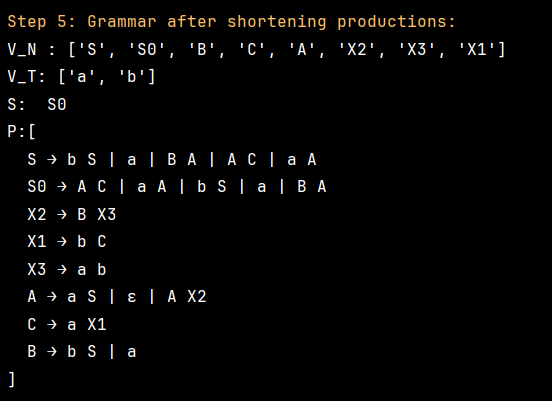
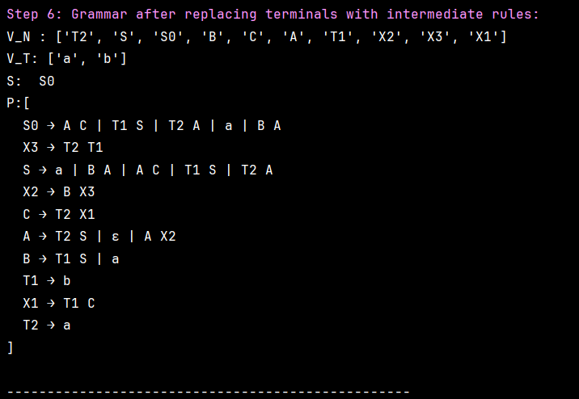
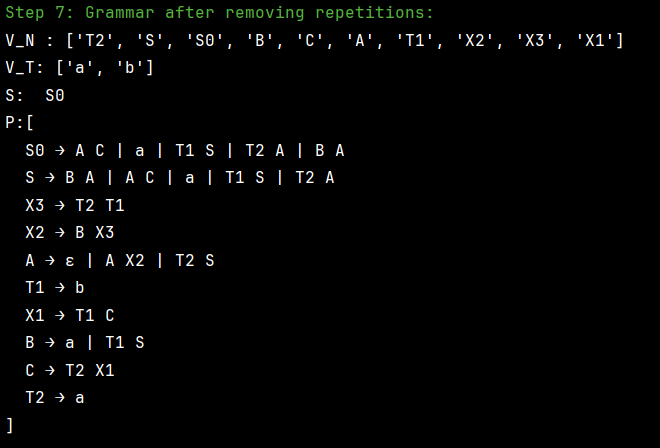

# Chomsky Normal Form

### Course: Formal Languages & Finite Automata
### Author: Nichita Gancear
### Group: FAF-232

----

## Theory

Chomsky Normal Form [^1] is a special form of Grammar where all the rules are in one of the following format:

1) _A -> BC_
2) _S -> ε_, if S is the starting symbol
3) _A -> a_

Chomsky Normal Form is usually used to simplify Context Free Grammar (Type 2, CFG). The key advantage is that in Chomsky Normal
Form, every derivation of a string of n letters has
exactly 2n − 1 steps [^2].

Here is the steps of converting a Grammar to Chomsky Normal Form:

0) If *S* symbol is met in RHS, then we create a new starting state (typically called *S0*) and make a transition *S0 -> S*.

1) Eliminate ε-transitions. In case there is A -> ε, it is considered a nullable. if a non-terminal in RHS has all the letters nullable, it is nullable as well (E.g. if in *B -> ACDE*, *A*, *C*, *D*, *E* are nullables, B is nullable). When nullables is defined, in each production in form *A -> BCDaE*, we add a set of all possible productions, where the nullable is absent. E.g.: if *B* and *D* and *E* are nullable, then we create a 2<sup>3</sup> new productions: B -> BCaE | BCDa | CDaE | CDa | ... | Ca.
2) Eliminate Unit productions. For all productions if form *A -> B*, replace this production in *A -> {set of production (except unit) of the grammar with B in LHS}*
3) Split long productions. If we have *A -> bCD*, replace it with *A -> bE* \*, and add production *E -> CD*
4) After the 3rd step, only production which needs fix are *A -> bC*. Replace them with *A -> BC* and add *B -> b*


The obtained Chosmky Normal Form is not unique for the Grammar. One can define either different variables for holding intermediate states, or use different algorithm of grouping the terms. But in the end, the obtained Grammar is equivalent to the initial Grammar, which means, It can describe the same set of words.

## Objectives:

1) Learn about Chomsky Normal Form (CNF)

2) Get familiar with the approaches of normalizing a grammar.

3) Implement a method for normalizing an input grammar by the rules of CNF.

## Implementation description

Here is step-by-step process of CNF-service work:

1) Creates rule S -> S0 if needed

```pytho
 def resolve_starting_symbol(self):
        if self.has_s_on_right(self.grammar.start_symbol, self.grammar.productions):
            new_start = Letter("S0")
            new_rule = DeriveRule(new_start, [self.grammar.start_symbol])
            self.grammar.productions.add(new_rule)
            self.grammar.non_terminals.add(new_start)
            self.grammar.start_symbol = new_start
```

This method uses has_s_on_right(), which checks if the start symbol appears on the right-hand side of any production. If it does, a new start symbol (e.g., S0) is created, a new rule like S0 → S is added, and the start symbol is updated. The new symbol is also added to the set of non-terminals. This ensures the grammar conforms to CNF requirements, where the start symbol must not appear on the RHS of any rule.

2) Eliminate epsilon transitions.

```pytho
 def eliminate_epsilon_transitions(self):
        nullable = set()
        for rule in self.grammar.productions:
            if rule.right == []:
                nullable.add(rule.left)

        changed = True
        while changed:
            changed = False
            for rule in self.grammar.productions:
                if all(sym in nullable for sym in rule.right) and rule.left not in nullable:
                    nullable.add(rule.left)
                    changed = True

        new_productions = set()
        for rule in self.grammar.productions:
            right = rule.right
            n = len(right)
            indexes = [i for i, sym in enumerate(right) if sym in nullable]
            for i in range(1 << len(indexes)):
                if i == 0:
                    continue
                temp = right[:]
                for j, idx in enumerate(indexes):
                    if (i >> j) & 1:
                        temp[idx] = None
                new_right = [s for s in temp if s is not None]
                new_productions.add(DeriveRule(rule.left, new_right))
        self.grammar.productions.update(new_productions)
        self.grammar.productions = {
            rule for rule in self.grammar.productions if rule.right != []
        }
```

This method extracts nullabes (already explained in Theory part what nullable is, and then adds to rules new ones with all the combinations with nullable removed)

3) Replace long production with short ones (E.g. A -> bCD to {A -> bE, E -> CD})

```pytho
 def eliminate_renamings(self):
        unit_pairs = {(rule.left, rule.right[0])
                      for rule in self.grammar.productions
                      if len(rule.right) == 1 and rule.right[0] in self.grammar.non_terminals}

        changed = True
        while changed:
            changed = False
            new_pairs = unit_pairs.copy()
            for (a, b) in unit_pairs:
                for (c, d) in unit_pairs:
                    if b == c and (a, d) not in new_pairs:
                        new_pairs.add((a, d))
                        changed = True
            unit_pairs = new_pairs

        new_productions = set()
        for (a, b) in unit_pairs:
            for rule in self.grammar.productions:
                if rule.left == b and (len(rule.right) != 1 or rule.right[0] not in self.grammar.non_terminals):
                    new_productions.add(DeriveRule(a, rule.right))

        self.grammar.productions = {
            rule for rule in self.grammar.productions
            if not (len(rule.right) == 1 and rule.right[0] in self.grammar.non_terminals)
        }
        self.grammar.productions.update(new_productions)
```
This method eliminates unit productions (renaming rules) of the form A → B, where both A and B are non-terminals, by computing their transitive closure and replacing them with equivalent non-unit rules.
4) Replaces all terminals with non-terminals

```pyhon
def replace_terminals_with_intermediate(self):
        new_productions = set()  
        terminal_map = {}
        counter = 1

        for rule in self.grammar.productions:
            new_right = []
            for sym in rule.right:
                if sym in self.grammar.terminals and len(rule.right) > 1:
                    if sym not in terminal_map:
                        new_var = Letter(f"T{counter}")
                        counter += 1
                        terminal_map[sym] = new_var
                        self.grammar.non_terminals.add(new_var)
                        new_productions.add(DeriveRule(new_var, [sym]))  # Add intermediate terminal rule
                    new_right.append(terminal_map[sym])  # Replace terminal with intermediate symbol
                else:
                    new_right.append(sym)  # Keep non-terminal or terminal unchanged
            new_productions.add(DeriveRule(rule.left, new_right))

        self.grammar.productions = new_productions  # Now update after iteration
```

This method is pretty straightforward. If the length of the RHS of a rule is greater than 1, it might contain terminals like in A → bC or A → bc, which are not allowed in CNF. So, for each terminal in such rules, we create a new non-terminal (e.g., T1) and add a rule like T1 → b. Then we replace the terminal in the original rule (e.g., A → T1C). In the end, all rules are updated accordingly.


## Conclusions / Screenshots / Results

The Variant 15th:




### Screenshots

1) Initial grammar



2) As one can notice, there are multiple productions which have *S* in RHS (E.g. *A -> aS*). Hence, we create a rule $S_0\rightarrow  S$, and add $S_0$ in $V_N$



3. In third step, we remove inaccessible (unreachable from S) states. From  image below we see that D dissapearred, since we don't have any rule which can lead to D.



4) Next, we remove $\varepsilon$-transitions. One of such is $A \rightarrow \varepsilon$. Since $A$ is nullable, in all the places where $A$ is present, we add a new rule where $A$ is absent. E.g: Since we had $S \rightarrow aA$, we add another rule $S \rightarrow a$




5) Remove renamings. In other words, we replace all $A \rightarrow B$ with rules $A \rightarrow \{\text{all rules of B}\} $. In this example. We replace $S \rightarrow B$ with $\{S \rightarrow bS, S\rightarrow a\}$. (Rule $S\rightarrow a$), already existed, so adding only the first.



6) Make transition shorter. The long transitions (with 3 or more letters in RHS) are split into several. 




7) The final algorithmic rule - replacing non-terminal symbols in rules with 2 letters in RHS with a non-terminal, with an intermediate step of transformation to terminal. 



8) Final step is simplifying repetitions. Anyone paying attention can notice that there are several non-terminals that lead to the same result—especially in one-letter rules like T1 → b, X1 → b, C → b, etc. All these repeating rules are grouped, a single representative (like T1) is chosen, and the rest are replaced everywhere they appear. For example, we originally had rules like X1 → b and C → b, but now they all point to T1 → b. So a rule like B → a | T1 S used to be B → a | X1 S or C S. It got updated to use the representative instead. As shown in the image, the final grammar is cleaner and shorter.




### Conclusions

In conclusion, I gained a deeper understanding of Context-Free Grammar (CFG) and its transformation into Chomsky Normal Form (CNF). The primary goal was to implement a converter that can take a simple CFG and systematically convert it into CNF, which is a standardized form that simplifies the parsing process in computational linguistics and automata theory.

The implementation of the converter was approached with flexibility and scalability in mind. I made sure to design the tool in a generic manner, allowing it to work with various types of grammars. This approach ensures that the converter can be easily adapted for use with different grammars, rather than being limited to a specific set of rules or structures. As always, I prioritized creating a solution that could handle a broad range of cases, making it as adaptable as possible for future applications.
## References

[^1]: Lecture Notes

[^2]: Clemson university, Chomsky normal form. https://people.computing.clemson.edu/~goddard/texts/theoryOfComputation/9a.pdf

[^3]: Wikipedia. Chomsky normal form. https://en.wikipedia.org/wiki/Chomsky_normal_form