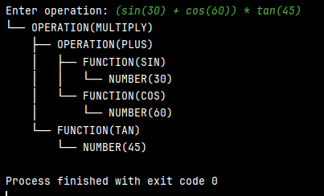

# LAB 6 : Parser & Building an Abstract Syntax Tree

### Course: Formal Languages & Finite Automata
### Author: Gancear Nichita

----

## Theory
When a computer processes code or structured input, the first step is to understand its structure—that's where parsing comes in. Parsing involves analyzing a sequence of tokens (generated from raw input) to determine its grammatical structure based on a predefined set of rules, known as a formal grammar. This process transforms unstructured input into a meaningful, organized form that software systems can work with.

A key result of parsing is the creation of an Abstract Syntax Tree (AST). An AST is a simplified, tree-like representation of the input that focuses on its logical structure, leaving out superficial syntax like parentheses or punctuation. Each node in the AST represents a meaningful element, such as an operator, number, or function, capturing the relationships and hierarchy within the input.

Parsing usually unfolds in stages. It often begins with lexical analysis, which breaks the input into tokens, followed by syntactic analysis, which constructs the AST. Various parsing techniques exist—such as recursive descent, LL, and LR parsers—each suited to different kinds of grammar complexity.
The combination of parsing and AST generation forms the backbone of tools like compilers, interpreters, and language processors. Beyond validating input, the AST enables further operations such as optimization, evaluation, and code generation.
## Objectives:
1. Understand the concept of parsing — Learn what parsing is, its importance in analyzing structured input, and how it can be implemented programmatically.
2. Explore the concept of Abstract Syntax Trees (ASTs) — Study how ASTs capture the hierarchical and logical structure of input data, and why they are useful in language processing tasks .
3. Perform the following implementation tasks:
1. Define and classify token types
   1. Create a TokenType (e.g., as an enum) to represent the different categories of tokens used during lexical analysis.
   2. Use regular expressions to identify the type of each token from the input.
2. Design AST data structures
3. Implement a simple parser program that could extract the syntactic information from the input text.


## Implementation description

### The ```Print``` method
* The method starts by printing the current node's value to the console, preceded by a prefix that visually represents the tree structure. This prefix is determined by whether the current node is the last child (isTail). If it is, the prefix will be └──; otherwise, it will be ├──.
  ```Pytho
  print(f"{prefix}{'└── ' if is_tail else '├── '}{self.node_type}({self.value})")
  ```
* After printing the current node, the method iterates over all its child nodes stored in the children list. For each child node, the print method is called recursively to continue printing the entire subtree.
  ```Pytho
  for i in range(len(self.children)):
    self.children[i].print(prefix + ('    ' if is_tail else '│   '), i == len(self.children) - 1)
  ```

### The ```Node``` enumeration
* The Node enum is defined to represent the different types of nodes that can appear in the Abstract Syntax Tree (AST). Enumerations like NodeType allow the program to categorize each node clearly, ensuring consistent labeling and easier processing later
  ```Pytho
  class Node:
    NUMBER = 'NUMBER'
    FUNCTION = 'FUNCTION'
    OPERATION = 'OPERATION'
  ```
* The ```NUMBER``` constant represents nodes that store numeric values, such as integers or floating-point numbers, parsed from the input expression.
* The ```FUNCTION``` constant is used for nodes that represent mathematical functions like sin, cos, and tan, allowing the parser and AST to distinguish functional operations from arithmetic ones.
* The ```OPERATION``` constant is used for nodes that represent arithmetic operations such as addition (+), subtraction (-), multiplication (*), division (/), or exponentiation (^).

### The ```Static ``` initialization Block for Token Patterns
* At the beginning of the static block, the ```patterns_builder``` is created to efficiently construct the regular expression pattern that will match all possible token types in the input text.
  ```Pytho
  patterns_builder = []

  ```
* The ```patterns_builder``` then appends different regular expression parts for each type of token. Each token type is wrapped in a named group (using the ```(?<NAME>...)``` syntax) to allow easy identification later during tokenization. For example, numbers, functions (sin, cos, tan), arithmetic operators, parentheses, and whitespace are all included.
  ```Pytho
  patterns_builder.append(r'(?P<NUMBER>\d+(\.\d+)?)')
  patterns_builder.append(r'(?P<SIN>sin)')
  patterns_builder.append(r'(?P<COS>cos)')
  patterns_builder.append(r'(?P<TAN>tan)')
  patterns_builder.append(r'(?P<PLUS>\+)')
  patterns_builder.append(r'(?P<MINUS>\-)')
  patterns_builder.append(r'(?P<MULTIPLY>\*)')
  patterns_builder.append(r'(?P<DIVIDE>/)')
  patterns_builder.append(r'(?P<POWER>\^)')
  patterns_builder.append(r'(?P<LPAREN>\()')
  patterns_builder.append(r'(?P<RPAREN>\))')
  patterns_builder.append(r'(?P<WHITESPACE>\s+)')
  ```
* After all the parts are appended, the final regular expression is compiled into a Pattern object named tokenPatterns. The call to ```substring(1)``` removes the very first extra ```|``` character added at the beginning of the pattern string.
  ```Pytho
  self.token_patterns = re.compile("".join(patterns_builder))
  ```
### The ```parseExpressions``` Method
* At the beginning of the method, the parseTerm() function is called to parse the first term of the expression. This term becomes the initial subtree that will be built upon as additional operations are processed.
  ```Pytho
  node = self.parse_term()
  ```
  * The method then enters a while loop to handle addition (+) and subtraction (-) operations. As long as the current token is a PLUS or MINUS, the loop continues processing, building the tree structure accordingly.
    ```Pytho
    while self.get_current_token().token_type in [TokenType.PLUS, TokenType.MINUS]:
      op = self.get_current_token()
      self.advance()
      right = self.parse_term()
      op_node = ASTNode(NodeType.OPERATION, op.token_type)
      op_node.add_child(node)
      op_node.add_child(right)
      node = op_node
    ```
### The ```parseTerm``` Method
* At the beginning of the method, the ```parse_factor()``` function is called to parse the first factor of the term. This factor becomes the starting subtree that will be expanded if further multiplication or division operations are encountered.
```Pytho
node = self.parse_factor()
```
* The method then enters a ```while``` loop to handle multiplication (*) and division (/) operations. As long as the current token is either a ```MULTIPLY``` or ```DIVIDE```, the loop continues to process the input accordingly.
  ```Pytho
  while self.get_current_token().token_type in [TokenType.MULTIPLY, TokenType.DIVIDE]:
    op = self.get_current_token()
    self.advance()
    right = self.parse_factor()
    op_node = ASTNode(NodeType.OPERATION, op.token_type)
    op_node.add_child(node)
    op_node.add_child(right)
    node = op_node
  ```
* Inside the loop, the current operator token (* or /) is retrieved and stored in a local variable op. After that, the parsing position is advanced to the next token to continue building the tree.
  ```Pytho
  op = self.get_current_token()
  self.advance()
  ```
* The right-hand side operand of the operation is parsed by calling ```parseFactor()``` again, producing the subtree for the next operand.
  ```Pytho
  right = self.parse_factor()
  ```

* A new ASTNode is then created to represent the operation. Its type is set to ```NodeType.OPERATION```, and its value is the string representation of the operator token.
  ```Pytho
  op_node = ASTNode(NodeType.OPERATION, op.token_type)
  ```
* The previously parsed node (```node```) and the newly parsed right-hand side (```right```) are added as children of the new operation node. This preserves the correct hierarchical structure for multiplication and division operations.
  ```Pytho
  op_node.add_child(node)
  op_node.add_child(right)
  node = op_node
  ```
### The ```Parse_Factor``` method
* At the beginning of the method, the current token is retrieved using ```get_current_token()```. This token is examined to determine the correct kind of factor to parse.
  ```Pytho
  token = self.get_current_token()
  ```
* If the token is a ```NUMBER```, it represents a simple numeric value. The parser advances the token position and returns a new ```ASTNode``` of type ```NUMBER``` containing the number's value.
  ```Pytho
  if token.token_type == TokenType.NUMBER:
    self.advance()
    return ASTNode(NodeType.NUMBER, token.value)
  ```
* If the token corresponds to a trigonometric function (```SIN, COS, or TAN```), the parser advances past the function name and expects an opening parenthesis ```(```. It then parses the inner expression inside the parentheses and expects a closing parenthesis ```)```. A new ASTNode of type ```FUNCTION``` is created to represent the function, with the parsed argument as its child.
  ```Pytho
  elif token.token_type in [TokenType.SIN, TokenType.COS, TokenType.TAN]:
    self.advance()
    self.expect(TokenType.LPAREN)
    argument = self.parse_expression()
    self.expect(TokenType.RPAREN)
    func_node = ASTNode(NodeType.FUNCTION, token.token_type)
    func_node.add_child(argument)
    return func_node
  ```
  * If the token is a left parenthesis ```(```, it indicates a grouped subexpression. The parser advances past the ```(```, parses the enclosed expression recursively, and expects a matching right parenthesis ```)``` before returning the parsed subtree.
    ```Pytho
    elif token.token_type == TokenType.LPAREN:
      self.advance()
      node = self.parse_expression()
      self.expect(TokenType.RPAREN)
      return node
    ```
* If none of the expected tokens are found, the method throws a ```RuntimeError``` to signal an unexpected token, indicating invalid input.
  ```Pytho
  else:
    raise RuntimeError(f"Unexpected token: {token}")
  ```

## Results

The expression ```(sin(30) + cos(60)) * tan(45)``` is parsed accurately by the lexer, which successfully identifies numbers, operations, functions, and parentheses without errors. The lexer correctly tokenizes components like sin, cos, tan, and the numbers ``30, 60, and 45``, as well as operators ``(+, *)`` and parentheses. The parser then constructs an abstract syntax tree (AST) that correctly respects operator precedence, ensuring that multiplication is nested more deeply than addition. Function calls like ``sin, cos, and tan`` are represented as parent nodes with their respective arguments (subexpressions) as child nodes. Parentheses are handled properly, ensuring that subexpressions such as ```(sin(30) + cos(60)) and tan(45)``` are treated as single units within the larger expression. The final AST faithfully represents the original mathematical structure, confirming that both tokenization and parsing are functioning correctly, even with complex and nested expressions.




## Conclusions
In conclusion, this laboratory provided valuable insight into the process of lexical analysis, parsing, and abstract syntax tree (AST) construction. While tokenizing basic elements like numbers, operators, and functions was easily done, handling the correct grouping of expressions using parentheses was more challenging. 

Building the AST while preserving operator precedence and properly nesting function calls required careful recursive parsing logic. Manually working through complex examples helped clarify how expressions must be structured within the tree and revealed subtle issues that were not immediately obvious in the initial implementation. This process deepened my understanding of parsing techniques and made the relationship between syntax and tree structure much clearer.
## References
1. Wikipedia. *Parsing*. Available at: [https://en.wikipedia.org/wiki/Parsing](https://en.wikipedia.org/wiki/Parsing)
2. Wikipedia. *Abstract Syntax Tree*. Available at: [https://en.wikipedia.org/wiki/Abstract_syntax_tree](https://en.wikipedia.org/wiki/Abstract_syntax_tree)