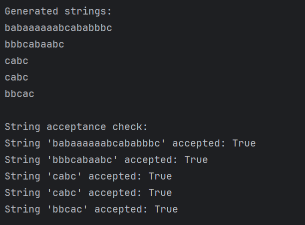

# Topic: Intro to formal languages. Regular grammars. Finite Automata.

### Course: Formal Languages & Finite Automata
### Author: Nichita Gancear 

----

## Theory
****
##### Formal Languages Overview
A **formal language** is a structured system of communication defined by precise mathematical rules. It comprises three core components:
- **Alphabet ($\Sigma$):** A finite, non-empty set of symbols (e.g., binary alphabet $\Sigma=$ {0, 1})
- **Vocabulary:** A set of valid words formed from the *alphabet*
- **Grammar:** A set of rules that dictate how valid *strings* are constructed from the *alphabet*
##### Alphabet and Strings
- **Alphabet ($\Sigma$)** - a finite set of symbols
- **String/Word** - a finite sequence of symbols from an *alphabet*. For example, *0011* is a string over $\Sigma=$ {0, 1}
- **Empty String ($\varepsilon$ OR $\lambda$)** - a *string* with zero symbols
- **Length ($|w|$)** - the number of symbols in a *string* (e.g., $|0101| = 4$)
- **$\Sigma^*$ (Kleene Star)** - the set of all possible *strings* over $\Sigma$, including $\varepsilon$
- **$\Sigma^+$** = $\Sigma^*$/{ $\varepsilon$ }, the set of all possible *non-empty strings* over $\Sigma$
##### Operations on Strings
- **Concatenation** - combining two strings $x$ and $y$ to form $xy$, *non-commutative*
- **Power Notation** - repeating a string $n$ times (e.g., $a^3 = aaa$)
##### Languages
A **language** $L$ is any subset of  $Σ^*$.
Some Operations on Languages:
- **Union:** $L_1 \cup L_2 = \{U \in \Sigma^* \mid U \in L_1 \text{ or } U \in L_2\}$
- **Intersection:** $L_1 \cap L_2 = \{U \in \Sigma^* \mid U \in L_1 \text{ and } U \in L_2\}$
- **Concatenation:** $L_1 L_2 = \{UV \mid U \in L_1, V \in L_2\}$
- **Kleene Star:** $L^* = \bigcup\limits_{i=0}^{\infty} L^{i}$
##### Grammars
A **grammar** $G$ is a 4-tuple $G=(V_N, V_T, P, S)$:
- $V_N$: Non-terminal symbols (e.g., variables like $S, A$)
- $V_T$: Terminal symbols (*alphabet* $\Sigma$)
- $P$: Production rules (e.g., $S \rightarrow aS$)
- $S$: Start symbol.
##### Chomsky Hierarchy
*Grammars* are classified into *four types* according to **Chomsky**:
1. **Type 0 (Unrestricted):** No restrictions on production rules
2. **Type 1 (Context-Sensitive):** Rules of the form  $\alpha A \beta \rightarrow \alpha \gamma \beta$.
3. **Type 2 (Context-Free):** Rules $A \rightarrow \gamma, \text{where } A \in V_N$.
4. **Type 3 (Regular):** Rules  $A \rightarrow aB$ (right-linear) or $A \rightarrow Ba$ (left-linear),  $A \rightarrow a$.
##### Regular Grammars and Finite Automata
- **Regular Grammars** generate regular languages, which can also be recognized by **finite automata**.
- **Finite Automaton (FA):** A 5-tuple $(Q, \Sigma, \delta, q_0, F)$:
    - ( $Q$ ): Finite set of states.
    - ( $\delta$ ): Transition function $( Q \times Σ \rightarrow Q )$.
    - ( $q_0$ ): Initial state.
    - ( $F$ ): Accepting states.

## Objectives:
****
1. Discover what a language is and what it needs to have in order to be considered a formal one.
2. Provide the initial setup for the evolving project that you will work on during this semester. You can deal with each laboratory work as a separate task or project to demonstrate your understanding of the given themes, but you also can deal with labs as stages of making your own big solution, your own project. Do the following:
   - Create GitHub repository to deal with storing and updating your project;
    - Choose a programming language. Pick one that will be easiest for dealing with your tasks, you need to learn how to solve the problem itself, not everything around the problem (like setting up the project, launching it correctly and etc.);
    - Store reports separately in a way to make verification of your work simpler;
3. According to your variant number, get the grammar definition and do the following:
    - Implement a type/class for your grammar;
    - Add one function that would generate 5 valid strings from the language expressed by your given grammar;
    - Implement some functionality that would convert an object of type Grammar to one of type Finite Automaton;
    - For the Finite Automaton, please add a method that checks if an input string can be obtained via the state transition from it;


## Implementation description

* In this program, I created a Grammar class to define a context-free grammar with non-terminals, terminals, production rules, and a start symbol. 
* The generate_string() method generates valid strings by replacing non-terminals with their production rules.
* The FiniteAutomaton class models an automaton with states and transitions. The string_belongs_to_language() method checks if a string is accepted by simulating state transitions.
* The main() function initializes the grammar, generates strings, and checks their validity through the finite automaton. The program also lets users input strings for validation.


* The Grammar class represents a context-free grammar, storing non-terminals, terminals, production rules, and a start symbol. It provides methods to generate random valid strings from the grammar and convert the grammar into a finite automaton.

```
class Grammar:
    def __init__(self, non_terminals, terminals, productions, start_symbol):
        self.non_terminals = non_terminals
        self.terminals = terminals
        self.productions = productions
        self.start_symbol = start_symbol

    # Generates a valid string from the grammar
    def generate_string(self):
        return self._generate_string_from_symbol(self.start_symbol)

    def _generate_string_from_symbol(self, symbol):
        if symbol in self.terminals:
            return symbol  

        # Get possible productions for the non-terminal
        production_options = self.productions.get(symbol, [])
        if not production_options:
            return "" 

        # Randomly pick a production and expand recursively
        production = random.choice(production_options)
        result = []
        for char in production:
            result.append(self._generate_string_from_symbol(char))
        return "".join(result)

    # Converts the Grammar object into a FiniteAutomaton object
    def to_finite_automaton(self):
        states = set(['q0', 'q1', 'q2'])  
        alphabet = self.terminals
        transition_function = {
            'q0': {'a': 'q1', 'b': 'q1', 'c': 'q2'},
            'q1': {'a': 'q1', 'b': 'q1', 'c': 'q2'},
            'q2': {'a': 'q1', 'b': 'q1', 'c': 'q2'}
        }
        start_state = 'q0'
        accepting_states = {'q2'}

        return FiniteAutomaton(states, alphabet, transition_function, start_state, accepting_states)
        
        
```

* The FiniteAutomaton class models a finite state machine with a set of states, an alphabet, a transition function, a start state, and accepting states. It includes a method to check if a given input string is accepted by the automaton by following the state transitions based on the input symbols.

```
class FiniteAutomaton:
    def __init__(self, states, alphabet, transition_function, start_state, accepting_states):
        self.states = states
        self.alphabet = alphabet
        self.transition_function = transition_function
        self.start_state = start_state
        self.accepting_states = accepting_states

    # Check if a given input string is accepted by the automaton
    def string_belongs_to_language(self, input_string):
        current_state = self.start_state

        for symbol in input_string:
            if symbol not in self.alphabet:
                return False  # Invalid symbol for the automaton
            if current_state in self.transition_function and symbol in self.transition_function[current_state]:
                current_state = self.transition_function[current_state][symbol]
            else:
                return False  # No transition for this symbol from the current state

        return current_state in self.accepting_states
```


* The main() function defines a context-free grammar with non-terminals, terminals, production rules, and a start symbol. It then generates five valid strings from the grammar, converts the grammar into a finite automaton, and checks if a set of test strings are accepted by the automaton, printing the results.

```
def main():
    # Define the grammar for Variant 15
    non_terminals = {'S', 'A', 'B'}
    terminals = {'a', 'b', 'c'}
    productions = {
        'S': ['aS', 'bS', 'cA'],
        'A': ['aB'],
        'B': ['aB', 'bB', 'c']
    }
    start_symbol = 'S'

    grammar = Grammar(non_terminals, terminals, productions, start_symbol)

    # Generate 5 valid strings from the grammar
    print("Generated strings:")
    for _ in range(5):
        print(grammar.generate_string())

    # Convert the grammar to a finite automaton
    automaton = grammar.to_finite_automaton()

    # Check if strings are accepted by the automaton
    test_strings = ["abc", "aab", "bca", "abcabc", "abcc"]
    print("\nString acceptance check:")
    for s in test_strings:
        print(f"String '{s}' accepted: {automaton.string_belongs_to_language(s)}")

```


## Conclusions / Screenshots / Results
****
In this section, besides the conclusion that gets described at the end, an example of output, resulted from the execution of the program, is also explained in-depth.
- The output begins by defining who is the creator of the program, together with an easy to read definition of the grammar, according to the assigned variant.

```
Nichita Gancear
FAF-232
Variant 15:
VN={S, A, B},
VT={a, b, c},
P={
    S → aS
    S → bS
    S → cA
    A → aB
    B → aB
    B → bB
    B → c
}

```
- The Grammar class effectively captures the production rules and non-terminal symbols, allowing for the generation of valid strings based on the given rules. By recursively applying the production rules, the generate_string() method produces strings like those specified by the grammar.



## Conclusion 
Through this project, we took a hands-on approach to understanding formal languages, regular grammars, and finite automata. We built a system that not only generates valid strings following specific grammatical rules but also verifies them using an automaton.
What stood out was how structured rules could create seemingly complex outputs while remaining predictable. Seeing the generated strings pass through the automaton for validation reinforced the practical connection between grammars and state machines.
This was a great exercise in bridging theoretical concepts with real implementation. Moving forward, refining the grammar, exploring more complex automaton behaviors, and optimizing transitions could make the system even more robust and insightful.