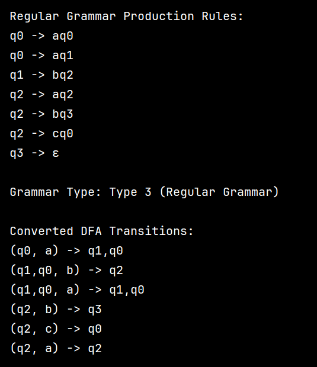
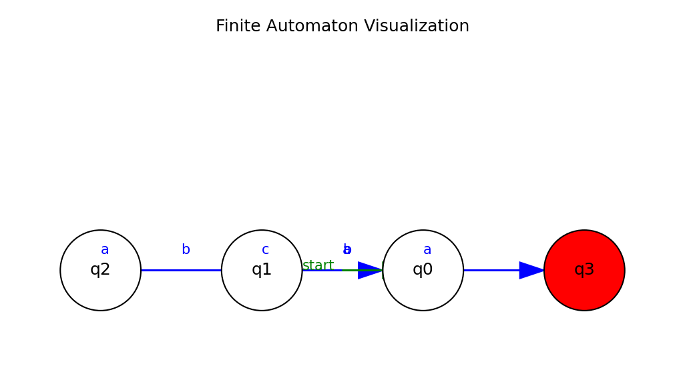

# Topic: Determinism in Finite Automata. Conversion from NDFA 2 DFA. Chomsky Hierarchy.
****
### Course: Formal Languages & Finite Automata
Author: Gancear Nichita
----

## Theory:
****
##### Introduction to Finite Automata
A **finite automaton (FA)** is a mathematical model used to describe computation or processes with a finite number of states. It is often visualized as a state machine where:
- **States:** Represent different configurations or conditions.
- **Transitions:** Dictate how the automaton moves from one state to another based on input symbols.
- **Start and Final States:** The automaton begins in a designated start state and may reach one or more final (accepting) states to signify successful processing.
  Finite automata are widely used in fields such as compiler design, pattern matching, and network protocols.
##### Regular Grammars and Finite Automata
- **Regular Grammars** generate regular languages, which can also be recognized by **finite automata**[[4]](#ref4).
- **Finite Automaton (FA):** A 5-tuple $(Q, \Sigma, \delta, q_0, F)$:
    - ( $Q$ ): Finite set of states.
    - ( $\delta$ ): Transition function $( Q \times Σ \rightarrow Q )$.
    - ( $q_0$ ): Initial state.
    - ( $F$ ): Accepting states.
##### Determinism in Finite Automata
The concept of **determinism** in finite automata refers to how predictable the system's transitions are:
- **Deterministic Finite Automata (DFA):**
    - For every state and input symbol, there is exactly one transition to a new state.
    - This makes the computational process unambiguous and straightforward, as each step is clearly defined.
- **Non-Deterministic Finite Automata (NDFA or NFA):**
    - For a given state and input symbol, the automaton may have several possible transitions (including the possibility of epsilon transitions, which occur without consuming an input).
    - Although multiple paths may exist, every NFA has an equivalent DFA that accepts the same language.
      Determinism is vital for predictability and efficiency, especially when the automaton is implemented in software. However, nondeterminism can simplify the design or modeling of complex systems even though it might need conversion into a deterministic form for execution.
##### Conversion from NDFA to DFA
To execute a nondeterministic model on deterministic hardware, it is often necessary to convert an NDFA into a DFA. This is achieved using the **subset construction algorithm**:
- **Step 1: Start with the epsilon-closure.**  
  Identify all states reachable from the start state via epsilon (ε) transitions. This set forms the DFA’s initial state.
- **Step 2: Process input symbols.**  
  For each DFA state (which represents a set of NDFA states) and for each input symbol:
    - Compute the set of NDFA states reachable by that input.
    - Apply the epsilon-closure on that resulting set.
    - This new set of states forms a new DFA state if it hasn’t been encountered before.
- **Step 3: Mark accepting states.**  
  Any DFA state that includes at least one NDFA accepting state is marked as accepting.
- **Step 4: Iterate until all transitions are defined.**  
  Continue processing until no new DFA states are generated.
  This algorithm guarantees that the resulting DFA recognizes the same language as the original NDFA, albeit often at the cost of potentially exponential growth in the number of states.
##### Chomsky Hierarchy
*Grammars* are classified into *four types* according to **Chomsky**:
1. **Type 0 (Unrestricted):** No restrictions on production rules
2. **Type 1 (Context-Sensitive):** Rules of the form  $\alpha A \beta \rightarrow \alpha \gamma \beta$.
3. **Type 2 (Context-Free):** Rules $A \rightarrow \gamma, \text{where } A \in V_N$.
4. **Type 3 (Regular):** Rules  $A \rightarrow aB$ (right-linear) or $A \rightarrow Ba$ (left-linear),  $A \rightarrow a$.  
   Finite automata are directly associated with **regular grammars (Type 3)**. This relationship means that every regular language (accepted by a DFA or NFA) can be described by a regular grammar, and vice versa.
##### Conversion from Finite Automata to Regular Grammar
The conversion process between a finite automaton and a regular grammar is systematic:
- **For every transition:**  
  If there is a transition from state $A$ to state $B$ on symbol $a$, you can introduce a production rule in the grammar:
  $A\rightarrow aB$
- **For every accepting state:**  
  If state $A$ is an accepting (final) state, add the production:
  $A \rightarrow \epsilon$
  This rule allows the grammar to generate the empty string, which reflects the automaton’s acceptance of the input when ending in a final state.
  This conversion establishes a direct mapping from the structural components of the automaton to the production rules of a regular grammar, thereby showing that the languages defined by finite automata and regular grammars are equivalent.

## Objectives:
****
1. Understand what an automaton is and what it can be used for.

2. Continuing the work in the same repository and the same project, the following need to be added: a. Provide a function in your grammar type/class that could classify the grammar based on Chomsky hierarchy.
   b. For this you can use the variant from the previous lab.

3. According to your variant number (by universal convention it is register ID), get the finite automaton definition and do the following tasks:
   a. Implement conversion of a finite automaton to a regular grammar.
   b. Determine whether your FA is deterministic or non-deterministic.
   c. Implement some functionality that would convert an NDFA to a DFA.
   d. Represent the finite automaton graphically (Optional, and can be considered as a **_bonus point_**):
    - You can use external libraries, tools or APIs to generate the figures/diagrams.
    - Your program needs to gather and send the data about the automaton and the lib/tool/API return the visual representation.

Please consider that all elements of the task 3 can be done manually, writing a detailed report about how you've done the conversion and what changes have you introduced. In case if you'll be able to write a complete program that will take some finite automata and then convert it to the regular grammar - this will be **a good bonus point**.

## Implementation description
****


The method iterates over all transitions. If any state-symbol pair maps to more than one next state, it's non-deterministic (NDFA).

```
def is_deterministic(self):
    for key, next_states in self.transitions.items():
        if len(next_states) > 1:
            return False
    return True
```
Converts each transition into grammar rules, ensuring final states allow ε (empty string) production.

```
def to_regular_grammar(self):
    rules = defaultdict(list)
    
    # Create production rules from transitions
    for (state, symbol), next_states in self.transitions.items():
        for next_state in next_states:
            rules[state].append(f"{symbol}{next_state}")

    # Add ε production for final states
    for final_state in self.final_states:
        rules[final_state].append("ε")
    
    return dict(rules)
```

The convert_ndfa_to_dfa method transforms a Non-Deterministic Finite Automaton (NDFA) into a Deterministic Finite Automaton (DFA) using the subset construction algorithm. It systematically explores all possible state sets, ensuring that for each input symbol, there is exactly one transition, as required by a DFA. The method returns a DFA with deterministic transitions and correctly identified final states, essential for applications like lexical analysis in compilers.
```
def convert_ndfa_to_dfa(self):
    dfa_transitions = {}
    start = frozenset([self.start_state])
    queue = deque([start])
    visited = {start}

    while queue:
        current = queue.popleft()
        
        for symbol in self.alphabet:
            next_states = set()
            
            for state in current:
                next_states.update(self.transitions.get((state, symbol), []))
            
            next_states_frozen = frozenset(next_states)

            if next_states:
                dfa_transitions[(current, symbol)] = next_states_frozen
                if next_states_frozen not in visited:
                    visited.add(next_states_frozen)
                    queue.append(next_states_frozen)

    # Final states in DFA are those containing any NDFA final states
    dfa_final_states = {s for s in visited if any(fs in s for fs in self.final_states)}

    return FiniteAutomaton(visited, self.alphabet, dfa_transitions, start, dfa_final_states)
```

The visualize method uses matplotlib to graphically represent a finite automaton. It displays states as circles, with final states colored red and the start state highlighted with a green arrow, while transitions are shown as arrows labeled with input symbols. This visual representation helps in understanding the automaton's structure and behavior more intuitively.
```
def visualize(self):
    plt.figure(figsize=(8, 6))
    pos = {state: (i*2, 0) for i, state in enumerate(self.states)}

    # Plot states
    for state in self.states:
        x, y = pos[state]
        color = 'red' if state in self.final_states else 'white'
        circle = plt.Circle((x, y), 0.5, color=color, ec='black', zorder=2)
        plt.gca().add_patch(circle)
        plt.text(x, y, state, fontsize=12, ha='center', va='center', zorder=3)

    # Plot transitions
    for (state, symbol), next_states in self.transitions.items():
        for next_state in next_states:
            x1, y1 = pos[state]
            x2, y2 = pos[next_state]

            plt.arrow(x1, y1, x2 - x1 - 0.5, y2 - y1,
                      length_includes_head=True, head_width=0.2, fc='blue', ec='blue')
            mid_x = (x1 + x2) / 2
            plt.text(mid_x, y1 + 0.2, symbol, color='blue', fontsize=10)

    # Indicate start state
    start_x, start_y = pos[self.start_state]
    plt.arrow(start_x - 1, start_y, 0.8, 0,
              length_includes_head=True, head_width=0.2, fc='green', ec='green')
    plt.text(start_x - 1.5, start_y, "start", color='green', fontsize=10)

    plt.axis('equal')
    plt.axis('off')
    plt.title("Finite Automaton Visualization")
    plt.show()
```


## Conclusions / Screenshots / Results
****
In this section, besides the conclusion that gets described at the end, an example of output, resulted from the execution of the program, is also explained in-depth.

- The output begins by showing the current Finite Automaton that was declared based on the Variant number, in this case Variant 1. In order to print it in this way, the program uses the method `ToString()` that was overridden in the previous laboratory.

```
Q = {{q0}, {q1}, {q2}, {q3}}
Σ = {a, b, c}
        δ({q0}, a) = {q0,q1}
        δ({q1}, c) = {q1}
        δ({q1}, b) = {q2}
        δ({q2}, b) = {q3}
        δ({q3}, a) = {q1}
q0 = q0
q_F = {{q2}}
```

- In continuity, after doing the call to `ToRegularGrammar()` method, it creates an instance of a regular grammar based on it, and prints it as well using the overridden `ToString()` method.

```
V_N = {{q0}, {q1}, {q2}, {q3}}
V_T = {a, b, c}
P = {
        {q0} ---> a {q0, q1}
        {q1} ---> c {q1} | b {q2} | b ε
        {q2} ---> b {q3}
        {q3} ---> a {q1}
}
S = q0
```

- Then, we call the `IsDFA()` method on the `FiniteAutomaton` instance, that checks whether the FA is deterministic or not.

```
Is the FA deterministic? False
```

- After that action, we are calling the `ToDFA()` method that creates another instance of a `FiniteAutomaton`, specifically a deterministic one, based on the non-deterministic `FiniteAutomaton` instance, while also printing it to the console.

```
Q = {{q0}, {q0, q1}, {q2}, {q1}, {q3}}
Σ = {a, b, c}
        δ({q0}, a) = {q0,q1}
        δ({q0,q1}, a) = {q0,q1}
        δ({q0,q1}, b) = {q2}
        δ({q0,q1}, c) = {q1}
        δ({q2}, b) = {q3}
        δ({q1}, b) = {q2}
        δ({q1}, c) = {q1}
        δ({q3}, a) = {q1}
q0 = q0
q_F = {{q2}}
```

- After instantiating the deterministic `FiniteAutomaton` object, we generate the graph, using the GraphViz tool  for the obtained FA, which gets saved in the *Graphs* folder,.

```
DOT file generated at: Graphs\FiniteAutomaton_20250303_131855549.dot
Graph generated successfully as "Graphs\FiniteAutomaton_20250303_131855549.png".
```

- Then we generate the `Grammar` instance for the obtained DFA, using the `ToRegularGrammar()` method once again.

```
V_N = {{q0}, {q0, q1}, {q2}, {q1}, {q3}}
V_T = {a, b, c}
P = {
        {q0} ---> a {q0, q1}
        {q0,q1} ---> a {q0, q1} | b {q2} | b ε | c {q1}
        {q2} ---> b {q3}
        {q1} ---> b {q2} | b ε | c {q1}
        {q3} ---> a {q1}
}
S = q0
```

-  Next, the program focuses on full-filling the Task no.1 where we have to check the grammar types based on Chomsky Hierarchy.
- Here we have an example for when the grammar **Type** is **0**, as in the section `Checking rule: LHS = BC, RHS = B` we can observe that the left-hand-side has less variables than the right-hand-side, which doesn't satisfy the requirements for type 1, 2, and the right-hand-side has more variables than one, so it cannot be type 2 or 3.




- A visualization of my Deterministic FiniteAutomaton graph




To sum up, in this laboratory work, all the established objectives were successfully accomplished through the implementation of various methods and algorithms related to finite automata and regular grammars.
Task 1, understanding what an automaton is and its applications, was achieved through a comprehensive implementation of the `FiniteAutomaton` class that handles both deterministic and non-deterministic automata.
For Task 2, the classification of grammars based on Chomsky hierarchy was implemented through the `CheckType()` method in the `Grammar` class. This method meticulously analyzes production rules to determine whether a grammar belongs to Type 0 (unrestricted), Type 1 (context-sensitive), Type 2 (context-free), or Type 3 (regular).
Task 3 was fulfilled through several key implementations:
- The conversion from finite automaton to regular grammar was accomplished via the `ToRegularGrammar()` method, which systematically transforms states and transitions into production rules.
- The determination of whether a FA is deterministic or non-deterministic was implemented through the `IsDFA()` method, which checks if each state-symbol pair leads to exactly one next state.
- The conversion from NDFA to DFA was realized in the `ToDFA()` method, which uses the subset construction algorithm to create an equivalent deterministic automaton.
- The graphical representation of finite automata was implemented in the `GenerateGraph()` method, which uses the *GraphViz* tool to generate visual diagrams of the automata.

The entire laboratory work was built upon the foundation of the previous lab, requiring significant modifications due to the statically-typed nature of C#. This presented a considerable challenge, as most class properties needed to be redefined with more complex types to accommodate the requirements of both deterministic and non-deterministic automata. For example, the transition function had to be changed from `Dictionary<(string, char), HashSet<string>>` to `Dictionary<(HashSet<string>, char), HashSet<string>>` to handle composite states in the DFA conversion.

These modifications demanded a deeper understanding of both the theoretical concepts and practical implementation details, particularly in handling the set operations required for the subset construction algorithm. Custom comparers like `HashSetComparer` and `TupleComparer` had to be implemented to ensure proper equality checking for composite states.

Despite these challenges, all functionalities were successfully implemented and tested with various examples, demonstrating the conversions between different forms of automata and grammars, as well as the classification of grammars according to the Chomsky hierarchy. The visual representation capability enhances the understanding of the automata structure and transitions, providing a valuable tool for analysis and verification.

## References
****

<a id="ref1"></a>[1] Laboratory Work 1: Intro to formal languages. Regular grammars. Finite Automata. task.md - Crețu Dumitru, Drumea Vasile, Cojuhari Irina -
https://github.com/filpatterson/DSL_laboratory_works/blob/master/1_RegularGrammars/task.md

<a id="ref2"></a>[2] "Formal Languages and Finite Automata guide for practical lessons" - COJUHARI Irina, DUCA Ludmila, FIODOROV Ion -
https://else.fcim.utm.md/pluginfile.php/110458/mod_resource/content/0/LFPC_Guide.pdf

<a id="ref3"></a>[3] Presentation on "Formal Languages and Compiler Design" - conf. univ., dr. Irina Cojuhari -
https://else.fcim.utm.md/pluginfile.php/110457/mod_resource/content/0/Theme_1.pdf

<a id="ref4"></a>[4] Presentation on "Regular Language. Finite Automata" - TUM -
https://drive.google.com/file/d/1rBGyzDN5eWMXTNeUxLxmKsf7tyhHt9Jk/view